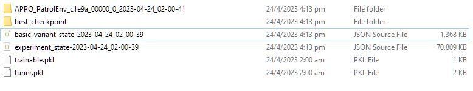
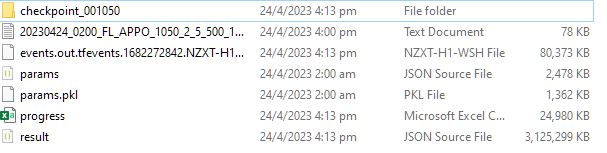

# Capstone Project - Dynamic Police Patrol Scheduling with Multi-Agent Reinforcement Learning

This is a code repository for MITB Capstone Project - Dynamic Police Patrol Scheduling with Multi-Agent Reinforcement Learning.

## Introduction

Effective police patrol scheduling is essential in projecting police presence and ensuring readiness in 
responding to unexpected events in urban environments. 
However, scheduling patrols can be a challenging task as it requires balancing between two conflicting objectives namely projecting presence 
and incident response. 

This solution is using Multi-Agent Reinforcement Learning (MARL) to address the Dynamic Bi-objective Police Patrol Dispatching and Rescheduling Problem (DPRP).
Our solution utilizes an Asynchronous Proximal Policy Optimization-based (APPO) actor-critic method 
that learns a policy to determine a set of prescribed dispatch rules to dynamically reschedule existing patrol plans.

## Getting Started

Install the dependency package via 

`pip install gym haversine numpy pandas requests scipy`

You also need to install Ray and RLlib. Please follow the instructions on the [RLlib website](https://docs.ray.io/en/latest/ray-overview/installation.html).

If you are on Ubuntu Linux environment, you can use the following command to install all the dependencies:

```
conda create -n rllib python=3.8
conda activate rllib
pip install -r requirements.txt
pip install -U "ray[air]" # installs Ray + dependencies for Ray AI Runtime
pip install -U "ray[tune]"  # installs Ray + dependencies for Ray Tune
pip install -U "ray[rllib]"  # installs Ray + dependencies for Ray RLlib
```

## Project Structure

```
├── main.py (main training and testing script)
├── checkpoint (folder for saving training and test evaluation results, model checkpoint)
├── config (config for model architecture and exploration strategies)
├── data (folder for storing training and test instances)
├── envs (folder for custom gym environment)
    ├── dynamic_patrol.py (gym environment for the project)
├── state
    ├── state.py (state object representation)
├── util (utility functions)
├── utils (helper functions)
├── entity (entity classes to encapsulate attributes of schedule, patrol agent and state object) 
```


## Data Preparation

### Train and Test instances

The training and test instances are pre-generated from a different project and should be placed in the `data` folder. 

The naming convention of the directory is as followed:

`./data/{Training/Testing}/{Poisson Mean}/{Sector}/`

In this project, the training and test instances are synthesized based on real-world data inputs of 
police sector boundaries.

### Training with Benchmarking dataset

For purpose of benchmarking, a myopic benchmark training dataset is also provided. 

This dataset provides the exact same training instance as required for benchmarking in the paper.

This is only used for benchmarking and not required for general training. 

The benchmark training dataset contains the metrics of the myopic baseline algorithm.

The directory of the benchmark training dataset is as followed:

`./data/Benchmark/`

## Usage

`main.py` is the main training and testing script for the project. The following is the list of arguments that can be passed to the script:

```
usage: main.py [-h] [--test {True,False}] [--sectors SECTORS] [--model MODEL] [--max_iter MAX_ITER] [--poisson_mean POISSON_MEAN] [--encoding_size ENCODING_SIZE] [--checkpoint CHECKPOINT] [--result RESULT] [--reward_policy {stepwise,end_of_episode}] [--checkpoint_frequency CHECKPOINT_FREQUENCY]
               [--num_gpus NUM_GPUS] [--num_envs_per_worker NUM_ENVS_PER_WORKER] [--num_workers NUM_WORKERS] [--verbose VERBOSE] [--resume {True,False}] [--exploration {StochasticSampling,EpsilonGreedy,Greedy}] [--benchmark {True,False}] [--num_scenario NUM_SCENARIO] [--learning_rate LEARNING_RATE]
               [--policy {single,multi}] [--nn_network {default,128x128_relu_attention}] [--theta_step THETA_STEP]

Police Patrol environment

optional arguments:
  -h, --help            show this help message and exit
  --test {True,False}   Run evaluation on test set
  --sectors SECTORS     Training sectors (e.g EFL means sectors E,F,L)
  --model MODEL         APPO, PPO
  --max_iter MAX_ITER   Number of iterations to train.
  --poisson_mean POISSON_MEAN
                        Param by Poisson distribution for generating incidents.
  --encoding_size ENCODING_SIZE
                        Size of neural network encoder
  --checkpoint CHECKPOINT
                        Output path for saving checkpoint
  --reward_policy {stepwise,end_of_episode}
                        Stepwise = reward on patrol presence given at each immediate step. End of episode = reward given at end of episode
  --checkpoint_frequency CHECKPOINT_FREQUENCY
                        Model checkpoint frequency
  --num_gpus NUM_GPUS
  --num_envs_per_worker NUM_ENVS_PER_WORKER
  --num_workers NUM_WORKERS
                        Number of workers for parallel sampling
  --verbose VERBOSE
  --resume {True,False}
                        Resume training from checkpoint
  --exploration {StochasticSampling,EpsilonGreedy,Greedy}
  --benchmark {True,False}
                        to run training with myopic benchmark dataset
  --num_scenario NUM_SCENARIO
                        Number of initial schedules/scenarios for training
  --learning_rate LEARNING_RATE
  --policy {single,multi}
                        Multi means each agent has its own policy network. Single policy is shared by all agents.
  --nn_network {default,128x128_relu_attention}
                        Size of neural network.
  --theta_step THETA_STEP
                        Penalty coefficient for Hamming distance.

```

### How to start training

To start training using benchmark training dataset, run the following command:

Example 1:

`python main.py --sectors EFL --model APPO --verbose 1 --num_workers 5 --reward_policy end_of_episode --max_iter 1000 --test False --resume False --benchmark True --policy multi --exploration Greedy --theta_step 1`

This sample command will setup training with the following parameters:

* Training sectors: `EFL`
* Model: `APPO`
* Number of workers: `5` (5 parallel workers) If you set this to be too high, it will cause instability and system crash. Beware of memory usage.
* Reward policy: `end_of_episode` (reward given at end of episode)
* Maximum iteration: `1000`
* Test: `False` (do not run test evaluation)
* Resume: `False` (do not resume training, this flag will delete all the previous training results and reset the training)
* Benchmark: `True` (use benchmark dataset for training)
* Policy: `multi` (each agent has its own policy network)
* Exploration: `Greedy` (greedy exploration)
* Theta step: `1` (penalty coefficient for Hamming distance. This is set to 1 for benchmarking. 

Example 2:

`python main.py --sectors F --model APPO --verbose 1 --num_workers 10 --reward_policy end_of_episode --max_iter 2000 --test False --resume False --benchmark False --policy multi --exploration EpsilonGreedy --theta_step 0.5`

This sample command will setup training with the following parameters:

* Training sectors: `F`
* Model: `APPO`
* Number of workers: `10` (10 parallel workers) We can run more workers for this sector because it is smaller than the previous sector.
* Reward policy: `end_of_episode` (reward given at end of episode)
* Maximum iteration: `2000`
* Test: `False` (do not run test evaluation)
* Resume: `False` (do not resume training, this flag will delete all the previous training results and reset the training)
* Benchmark: `False` (use normal training dataset for training, in this case, the metrics for myopic baseline algorithm will not be available)

## How to Resume Training

To resume training, simply use the same command as the previous training except that you need to set `--resume True`.

However, I found that the checkpoint does not always work properly with Ray Tuner. You can read more about the issue [here](https://github.com/ray-project/ray/issues/4569).

I advise user to complete the training as a whole instead of resuming training halfway.

## Training Result

The training results and model checkpoints will be saved in `./checkpoint/` folder.

With every training, we will create a subfolder with the following naming convention:

`{args.sectors}_{args.model}_{args.max_iter}_{args.poisson_mean}_{args.encoding_size}
{args.num_scenario}_{args.theta_step}_{args.exploration}_{args.policy}_{args.nn_network}`

For example:

`./checkpoint/EFL_APPO_100_2_5_500_0.0_EpsilonGreedy_multi_default`

This is a sample screenshot of the content:



The content of the folder is as followed:
* `APPO_PatrolEnv_xxxxxxxxx` folder: This is the folder where we store the training results and model checkpoints.
* `best_checkpoint` folder: This is the folder where we store the best model checkpoint. This folder is only created at the end of training.
* `basic-variant-state`, `experiment_state`, `trainable.pkl` and `tuner.pkl` these are config, state and parameter files required for Ray to restore training.

### Training results

The training result is saved in the subfolder of `./checkpoint/EFL_APPO_100_2_5_500_0.0_EpsilonGreedy_multi_default/APPO_PatrolEnv_xxxxxxxxxxxx` folder.

The content is shown here



`progress.csv` stores the training results. You do not need `result.json`, `progress.csv` is sufficient.

### Model checkpoint

The best model checkpoint is stored in `best_checkpoint`. This folder is only created at the end of training.

This is the folder where we restore and load the model for test evaluation.

The model checkpoint is also  stored at regular interval in `./APPO_PatrolEnv_xxxxxxxxxxxx/checkpoint_{training iteration}` folder.

## Running Test Evaluation

To run test evaluation, you need use the same arguments for training but change the following flags to `True`: 

`--test True` and `--resume True`.

Setting the `test` flag to True will load the environment with test dataset before running an evaluation.

Setting the `resume` flag to True will load the checkpoint from the previous training. 

:warning:IMPORTANT ! 

If you forget to set `resume` to True, it will delete the previous training results and checkpoint.

The result of the test evaluation will be saved in `./checkpoint/{experiment folder name}/test_metrics.csv` file.

## Configuration

There are two sets of configuration parameters in this project.

The first set is in `./config/config.json`. This file contains the configuration for the environment and the exploration policy.:

```
{
  "travel_matrix_fpath": "./data/RawData/travel_time_matrix.pkl",
  "exploration_config": {
    "StochasticSampling": {
      "type": "StochasticSampling",
      "random_timesteps": 0
    },
    "EpsilonGreedy": {
      "type": "EpsilonGreedy",
     "initial_epsilon": 0.6,
     "final_epsilon": 0.01,
     "epsilon_timesteps": 3000
    },
    "Greedy": {
      "type": "EpsilonGreedy",
     "initial_epsilon": 0.0,
     "final_epsilon": 0.0,
     "epsilon_timesteps": 1
    }
  },
  "model": {
    "default": {
      "conv_activation": "relu"
    },
    "128x128_relu_attention": {
      "fcnet_hiddens": [128, 128],
      "fcnet_activation": "relu",
      "conv_activation": "relu",
      "use_attention": 1
    }
  }
}
```

The second set is in `./constants/Settings.py`. The content of the file is self-explanatory. Here i will just highlight 
the key ones:

```
#max hamming distance soft constraint
MAX_HAMMING_DISTANCE = 0.4
#weight for hamming distance penalty
THETA = 0.5 # this is overwritten by theta_step in main.py
#weight for respond reward
OMEGA = 5 # weight for respond reward. Not adjustable in the current version of `main.py`
```

## Acknowledgement

The development of this code owes its success to [Waldy Joe](https://scholar.google.com/citations?user=RGZhfxYAAAAJ&hl=en) who has been a great mentor and friend.

This project is based on the following open source projects:

- [Ray](https://docs.ray.io/en/latest/ray-overview/getting-started.html)
- [RLlib](https://docs.ray.io/en/latest/rllib/index.html)
